# E Suite
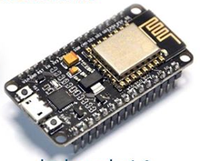
An integrated suite of Lua files for ESP8266

## Overview:

This suite of files is intended primarily for use with ESP12-based
boards (including NodeMCU and Wemos D1-mini), but it does work for
ESP-01, within its gpio limits.

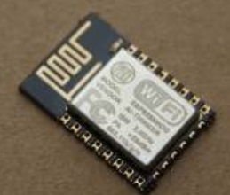It automates the standard startup including escape time, wifi connection and time
setting. This leaves you to concentrate just on your project scripting: on exactly
what you want to control. Included is a collection of drop-in library
files for many common devices. The library files are generally fairly
practical and needing minimal configuration in your project.

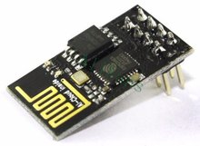The eSuite projects are intended to be used as client (“STATION” mode)
in conjunction with a nearby wifi access point. The ESP8266 is a
wifi-capable chip, and merely using an isolated “blink a LED” project
misses its point!

Your NodeMCU build from **http://nodemcu-build.com** will need to include
code modules required for your project. I typically build with these
options, and I use the “float” version:

**adc, adxl345, bit, bme280, dht, file, gpio, http, i2c, mqtt, net, node,
pwm, rtcmem, rtctime, sntp, spi, struct, tmr, u8g, uart, wifi.** 

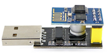U8g
supports the OLED screens, so choose 128x64 or 64x48 according to your
type. Use a NEW or recent build of firmware. Some commands changed syntax in 2017. 

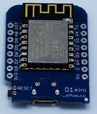Recommend using **pyFlasher** to load to ESP. See
https://github.com/marcelstoer/nodemcu-pyflasher.

ESPlorer is assumed as the regular IDE used for loading lua scripts to
the ESP8288 and for interacting with your project during testing. 
However, after deployment, telnet may be a better monitoring
tool in place of ESPlorer.

The NodeMCU Lua environment uses the marked numbers for GPIO pins (D0 D1 etc),
coded simply as 0, 1 ... This is NOT the chip's native GPIO numbering as used by the arduino-esp environment. [Opinion: historically a wrong choice, but that's what we have to work with.]  For the expansion gpio and adc pins in certain libraries below, that numbering pattern is used/extended for the added pins too.

## Common startup files:

1. init.lua
1. init2-WIFI.lua
1. init3-TIME.lua

These are always used. They chain in sequence, and then pass control to
your individual “project” file. So the standard minimum is four files.

## Library Files:

-   lib-BLYNK.lua
-   lib-LOGGER.lua
-   lib-OLED.lua
-   lib-OLED-D1.lua
-   lib-SERVO.lua
-   lib-DEEPSLEEP.lua
-   lib-MQTT.lua
-   lib-ACCEL.lua
-   lib-TELNET.lua
-   lib-THINGSPEAK.lua
-   lib-ULTRASONIC.lua
-   lib-WEBSERV.lua
-   lib-WIFIMON.lua
-   lib-SMARTBTN.lua
-   lib-GPIO28.lua
-   lib-ADC8.lua
-   lib-ADC4.lua
-   lib-GPS.lua
-   lib-STEPPER.lua
-   lib-TONE.lua
-   lib-MATH.lua

You **optionally** include library files into your project file. 
These libraries add a lot of "drop-in" functionality
beyond the rom-based functions in your NodeMCU build.
In many cases, simply loading the library file (with dofile()) will do its initialising without further calls.

## General usage:

As above, the regular simple project is started from each reset like this:

1. init.lua
1. init2_WIFI.lua
1. init3_TIME.lua
1. projectXX.lua

Any further libraries are run only according to what you code in your
project script.

During development or experimenting, you may have various 
"project" files uploaded to ESP8266 at any time. 

**Q:** So which project runs when the "init" is complete?   
**A:** Edit top line of your init.lua to name your required project.
Then upload the changed init.lua to ESP8266 again, and reboot.

Try not to damage init.lua. That can cause repetitive reboots that 
sometimes only a re-flash of the lua binary can fix.

All of the files you need for your project to run must be uploaded to the ESP8266.
You can see the loaded files listed by clicking RELOAD at right side column.

You may find editing and uploading your lua files more intuitive
if you DON'T use ESPlorer's left panel file edit facility. Simply
use your choice of external editor (I use geany, but everyone
has some preference), and then use ESPlorer just to upload. 
UPLOAD button is at bottom right of left side footer.

You never start files executing by clicking on the file listing at
right hand column. You always restart the project running by doing a full reboot, 
and the init files and project file will run as a sequence:

-   press the reset button (hardware reset)
-   or (if ESPlorer is "talking" to the ESP) click RESTART at bottom right
(software initiated reset)

How do you see if the terminal is "talking" to your ESP? Is the port
"Open"? Try clicking the HEAP button. If a (bytes of memory) 
number comes back, then yes it's working. And the software-based RESTART 
button can do the reboots for you.

There is a function included ("approximately friendly") to capture 
and report any "missing file" errors. (You forgot to upload a required library file?)

Here are the areas you probably need to edit for your own circumstances:

-   init.lua - to set the name of currect project file
-   init3-WIFI-lua - to nominate your wifi AP(s) and password
-   Your APIKEY for a Thinkspeak project. In your lib-THINGSPEAK.lua
-   Your login address and credentials for a MQTT job - in lib-MQTT.lua
-   Your blynk token for a blynk project. In {token}.lua 

One more hint: During your testing, CPU/Lua "panic" errors 
will cause reboots. Get used to them: work with the limitations of a 
tiny processor. To view the "panic" message, turn off "Autoscrolling"
(up near the port OPEN/CLOSE button) and scroll the terminal window up 
to just before the reboot messages. Usually you can read
the offending lua script name and the problem line number. 

## 1. init.lua:

Has a 5 second wait period before chaining to WIFI file. During the wait
time the inbuilt led (D4) on ESP12 submodule will blink. The “flash”
button (D3) is read at the END of the blinking period, and if being held
will abort any further processing. This allows a crashing lua file to be
caught before entering reboot cycle.

The 5 second wait time uses timer 0. With ESPlorer, using COMMANDS tab /
TIMER STOP 0 will also prevent further processing. Then you can
remove/repair any misbehaving lua scripts.

Init.lua also sets up a method of gently catching most cases of missing files
that could cause dofile() to begin endlessly rebooting in panic.

The top line declares the project file you are running. Eg **proj =
“project12”**: that would run project12.lua.

Init.lua includes an intercept to recognise a wake out of deepsleep.
If coming out of deepsleep, there can be different options on just how it starts up. 
This functionality is discussed in deepsleep module.

Init.lua permits the ESP wifi to auto-connect (while waiting during blinking
mode) to the last saved wifi access point. In any case, the file init2-WIFI
is called after the 5 second wait time.

Try not to tinker carelessly with init.lua. A really broken init.lua can
cause repeated panic/reboot that only a binary re-flash of lua can salvage!

## 2. init2-WIFI.lua:

If the ESP has successfully auto-connected, this file has nothing to do,
and chains immediately to init2-TIME. Otherwise it waits and continues
retrying to connect, if necessary cycling between the configured wifi
credentials given.

One or several wifi stations may be listed as acceptable. This allows
for easily using in classroom and at home: the ESP will find the
available Access Point for each premises.

A single AP can be designated like this:

	APlist = { "ap", "pw" }

Multiple can be listed like this:

	APlist = {
		{"JohnsHome", "xxxxxx"}, 
		{"theSands", "password"}, 
		{"bluerat", "yyyyyyyy"}
	}

After wifi becomes connected in this process, then if any later
disconnect occurs, the ESP will automatically reconnect to that same AP
when available.

On wifi connection, control is passed to init3-TIME.

As currently programmed, this module does NOT PROGRESS FURTHER if no
wifi connection is established.

Note that is IS LEGAL (if unusual) to call init2-WIFI again later from
your project. init2-WIFI in this case will not chain to SNTP or other
files. It will allow you to attempt connections to the other Access Points
in your list.

## 3. init3-TIME.lua:

The ESP8266 has no time function that can survive being powered down. A Realtime Clock ("RTC") function is on the chip, but there is no battery to run that over power down. The RTC once set to correct time can give us time as a "timestamp", in seconds since 1970. See rtctime.get().

("Deepsleep" operation with power still applied can, if programmed correctly, preserve the correct time for waking.) 

This module connects on the internet to a SNTP server to set the
RTC of the ESP. As currently programmed, one of
**1.au.pool.ntp.org** up to **4.au.pool.ntp.org** is randomly chosen.
You may choose to use other time servers to suit your location. Note
that frequently calling a single timeserver (eg during rapid
testing/rebooting) seems sometimes to cause denials from the afflicted
timeserver!

Fetching true time, as for any internet request, can sometimes fail, in which case ESP time is usually
set at 1970. If time from SNTP server does fail, **and** the ESP is awaking
from deepsleep, then the time is left at the time preserved by the
deepsleep functioning. This can be a bit inaccurate, as the low-res
timekeeping during deepsleep may run fast or slow by as much as (from
experience) 5%.

On either success or fail of timesetting, control passes to your project file.

This file gives you a **Time()** function to return current time as readable text. With a timestamp parameter, Time(ts) can convert any system timestamp (as from rtctime.get()) into readable form. 

Note that is IS LEGAL (if unusual) to call init3-TIME again later from
your project. init3-TIME in this case will not chain recursively to your
project file (which is still running).. But it will attempt again to
fetch true time.

## 4. Your Project File:

The project file is named at top of init.lua. The ESP filesystem may
have multiple project files loaded at any time, but only one is named in init.lua to run.  Change init.lua and load it again, and then reset, to run a different project.

When your project file starts,

1.  Wifi connection has been established
1.  Best effort has been made to set real-time in the ESP’s clock.

The init sequence (init.lua, init2-WIFI.lua, init3-TIME.lua) are
considered as (approximately) fixed unchanging files. Every project uses
them as the startup sequence. All your individual project scripting
belongs in your project file, which in many cases can be quite brief.
For example (jumping ahead to the blynk library!) the following 2-line
**complete** project file can use BLYNK app on your phone to control the
GPIO inputs and outputs on the ESP:

	-- myproject.lua
	dofile ( 'lib-BLYNK.lua' )
	blynk.new (“your ...... blynk token”):connect()

Even simpler, try this one-line project file!

	dofile("lib-TELNET.lua")

There are many example project files in the projects folder. 
Refer there to the PROJECTLIST index.

## lib-OLED.lua
### (and lib-OLED-D1.lua):

This library is for the common “0.96-inch” 128x64 I2C oled display. 

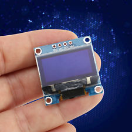By default all I2C devices in this suite use pins SDA=D2 and SCL=D1 for I2C. 
These can be overridden by presetting global variables **sda** and **scl**
before starting any I2C devices.

Load the OLED library in your project file like this, omitting the SDA and SCL
lines if default pins are OK::

	sda = 3
	scl = 4
	dofile("lib-OLED.lua")

On initialising, the current node’s wifi hostname and IP number and the
time will display.

There are four standard calls your project can make to display on the
OLED:

	oled("j", "new entry" ) 
	oled("m", { "WARNING !", "", "IP Address ", wifi.sta.getip() } )
	oled("y", { "STOP", "WRONG WAY" } )
	oled("b", { "Temp", 17} )

These are:

- Journal mode "j":  stack of up to four log messages, pushed in one at a time at the bottom
- MessageBox mode "m": Bold header text, with three message lines in a box
- Yell mode "y": Two very bold words
- Value Bar mode "b": Scaled display bar 0-100

If the oled failed to initialise, oled() calls still in your project
code are harmless. If your binary lua build did not include the correct
u8g modules, initialising may crash!

The oled display is easy to interface and it is easy to code with
useful messages. It is a popular inclusion in many projects.

*lib-OLED-D1 is a rescaled version suited to smaller OLED used by D1
Mini OLED shield.*

Oled library is simply based on U8G examples in NodeMCU project.

## lib-BLYNK.lua:

This library (a derivative of Blezek library) connects to the BLYNK APP
on your android or apple phone or tablet. Blynk includes many “widget”
icons to control or read devices or GPIOs on the target “device”. Our
device (aka our “hardware”) is the ESP8266. You will configure a widget
on the APP for each thing you want to control on the ESP.

But you must configure the “device” setting on your tablet as
“**generic**”, not “ESP8266” or “NodeMCU”. Both those will attempt to
use native CPU gpio numbers at your ESP. That would suit “arduino mode”
of programming the ESP8288, but our eSuite is written in Lua which uses
the “D0 D1” labelling as written on the module.

The library has TWO files, lib-BLYNK.lua and lib-BLYNK2.lua. They come
as a pair. As lua files go, this is a large library. Loading a single
file this size has a high risk of a memory crash. (You will see “E:M”
messages and panic reboot.) The file splitting reduces the memory
stress. You do not reference the second file: it is loaded automatically
by the first.

Using Blynk library can be trivially easy, as above in project file section, or it may require
some careful scripting to customise it to exactly what you want.

The Blezek library is very "lean". In general you code your
own handling for incoming and outgoing blynk messages between
ESP and phone, except for generic GPIO control, which is very easy.

The full initialising in your project is like this:

	dofile ( 'lib-BLYNK.lua' )
	b=blynk.new (“your ...... blynk token”, setup_callback_function, TraceMode)
	b:connect()

The bottom lines can be merged as in the example earlier.

**TraceMode** is usually omitted. If it is **true** then a diagnostic trace of
each data packet to and from the blynk server is displayed.

If the **setup_callback_function** is **omitted or nil**, then a
generic GPIO I/O functioning is automatically provided for gpio.read()
and gpio.write(). Setup_callback may also be set as **false**, in which
case no callback is made. If you DO specify your own callback, it will
happen immediately the blynk “object” is created (before even your next line of project file), 
and you would use it
to “register” more callbacks for later. Study the following project
file. (Approximately) study it from bottom up.

	function dw_cb(cmd) -- gpio write
		gpio.write(cmd[2],cmd[3])
	end
	function dr_cb(cmd, msgid) -- gpio poll
		value = tostring(1 - gpio.read(cmd[2]))
		b:send_message(blynk.commands["hardware"], 
		msgid, b:pack('dw', cmd[2], value))
	end
	function pm_cb(cmd) -- let us do auto setup of gpios to match the APP
		for i=2, #cmd, 2 do
			if cmd[i+1] == 'in' then 
				gpio.mode(cmd[i], gpio.INPUT, gpio.PULLUP) 
			end 
			if cmd[i+1] == 'out' then 
				gpio.mode(cmd[i], gpio.OUTPUT) 
				gpio.write(cmd[i],0) 
			end 
		end
	end
	function set_callbacks(b)
		b:on ('dw', dw_cb) -- means: on occurrence if any “dw” event, call dw_cb()
		b:on ('dr', dr_cb)
		b:on ('pm', pm_cb)
	end
	dofile ( 'lib-BLYNK.lua' )
	b = blynk.new ( token, set_callbacks ):connect()

At the bottom, we start blynk, and that triggers the “set_callbacks”
function. set_callbacks() registers three further callbacks that blynk
will later call at each “**pm**” message or “**dw**” or “**dr**”
message.

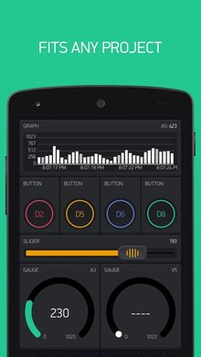Blynk keeps an array of callbacks, including

-   “receive”, “connection”, “disconnection” (all events happening at
    the level of TCP/IP connection to blynk server, and that we usually
    don’t want to know about), and

-   optionally any of the blynk incoming message designators, “pm”,
    “dr”, “dw”, vr”, ‘vw” and “ar” (ie digital read, virtual write etc).
    These are as viewed from the APP’s perspective, so “dw” is a write
    from APP, expecting us to change a GPIO pin..

The example we are examining will use the “dr” and “dw” for gpio
control, and “pm” which advises of the APP widget expectations.

Blynk calls back on events like “dw”, “dr” etc (the data packets coming
from the server, ie from your phone) only if you “register” to receive
for those events with the **b:on()** command.

These callbacks receive as payload the parameter “cmd”. cmd is an array (table) like
{ “dw” , “4”, “0” } , 
where we already knew the “dw”, the next is pin
number, the third is (in this case) the 1 or 0 (High/Low) for the write.
So getting pin number is as easy as cmd[2].

It can be important to recognise that all the indexed members of the cmd
table are STRINGS. It is wise to immediately force the parameters you
are expecting as numeric to really be numeric like this: **pin =
tonumber(cmd[2]).** Otherwise you may find errors in your code where
the string value was not acceptable, a number being needed.

So now we have set blynk to call back on every incoming “pm”, “dr” and
“dw”. pm_cb() lets us configure our GPIOs according to the current APP
widgets. dw_cb() happens each digital write message, so we simply
perform the requested write to the real hardware. And at each “dr” we
read the hardware and invert the 0 / 1 (because we know it’s a
pull-to-ground button where 0 = PRESSED). Then we do a b:send_message()
to push the reading back to the APP, typically in a “Value Display”
widget set to scheduled polling mode. And this time the “dw” label
refers to the viewpoint of our ESP, ie “dw” is outgoing, towards the
APP.

- - - - - - -

Let’s look at another example project file:

	pir=6 -- ie d6
	gpio.mode(pir, gpio.INPUT, gpio.PULLUP)
	function conn_cb() -- calls when blynk successfully connects.
			gpio.trig(pir, "down", function()
			b:send_message(blynk.commands["notify"], 
            	b:mid(), "Alarm at home")
		end)
	end
	function set_callbacks(b) -- called as blynk is setting up
		b:on('connection', conn_cb) -- set this for AFTER blynk gets connected
	end
	dofile ( 'lib-BLYNK.lua' )
	b = blynk.new ("the token", set_callbacks ):connect()

At the top, we assign a PIR sensor on D6 as input. We will shortly
further assign it as “TRIG” operation, ie to cause its own callback
action if it senses an intruder.

At bottom, we start blynk with set_callbacks function. That function (a
few lines earlier) “gets called” and it is given the blynk object (b) as
its payload, in case it didn’t know it. Its job is to instruct b that
when b (ie blynk) establishes server connection then call another
callback we called conn_cb. OK, so a very short time later (half
second??) blynk gets connected, and calls conn_cb(). Conn_cb puts D6
into trigger mode, and tells D6 to call that “b:send_message()” to our
APP on any alarm. Callback within callback within callback. Oh, and an
anonymous function as well. There was a lot in that 12 line project
file!

**Result:** Each intruder event sends a notification to your phone.

- - - - - - -

The last function in lib-BLYNK file is blynk_autogpio(). You can study
that to see that it follows the same patterns as the hand-coded examples
above.

It is also legal to specify your own setup_callback in the blynk.new()
line, so that the autogpio is NOT the automated callback now, ... **and
then** to include your own call to blynk_autogpio(b) inside YOUR
setup_callback. That way, you can get the automated GPIO handling, and
still have opportunity to do any further setup you need.

- - - - - - -

The **send_message()** syntax in blynk is a bit arcane, sorry. Here are
some other templates:

**b:mid()** -- generates our new (sequential) message ID number for
outgoing message.

When your outgoing message is a REPLY to incoming poll/request, you
should use instead the original message ID that just came in. (Although
it does not seem to matter a lot?)

**function vw_cb(cmd)**

Whatever you want to code. Note some vw (eg from accelerometer in phone) 
might have several cmd[] parameters.

**function vr_cb(cmd, orig_msgid)**

Prepare your payload value to be sent back to APP, like this:

	b:send_message(blynk.commands["hardware"], orig_msgid, b:pack('vw', cmd[2], str_payload))

For virtual pins, several payload parameters might be legitimate in
some cases.

**b:send_message(blynk.commands["hardware"],
b:mid(), b:pack('vw', vpin, str_payload))**

Case of “vw” being pushed from ESP to APP, but not in response to any
poll from APP. We need our own new message id.

**b:send_message(blynk.commands["bridge"], b:mid(), 
b:pack('20', 'i', remote_token ))**

Create bridge ESP to ESP. This message is addressed to our server.
Register the other ESP’s token against our VP 20.

**b:send_message(blynk.commands["bridge"], b:mid(), 
b:pack('20', 'vw', '65', str_payload))**

Bridge message from ESP to ESP. This message leaves here as writing to
our Virtual Pin 20, but the server already knows that that pin is a
bridge to another ESP. In this example, the server sends message { “vw”,
“65”, “payload” } to the other ESP, who doesn’t care quite where the
message originated from!

**b:send_message(blynk.commands["property"], b:mid(), 
b:pack(vpin, 'color', “\#123456”))**

This changes widget colour (std html colour codes). ONLY for virtual
pin, not digital pin.

There is one helper function provided for the “vw” and “dw” writes to
the APP. Eg

**b:write(“vw”, 5, value)**

This just simplifies the longhand hardware/vw or /dw send_message() as
above. These two commands are the most common customised requirement, so
this simpler version is welcome! (It should be fine for "aw" also.)

- - - - - - -

The commands “hardware”, “property”, “bridge” and “notify” seen above
are blynk terms. You can see them at top lines of library.

Under various communication/network problems, or loss of server
response, blynk can disconnect. It will attempt to restore connection
and log in again to the server when it becomes possible. If wifi itself
fails, then of course blynk is disconnected. Wifi should auto-reconnect
when/if available, and then blynk should also log itself in again.

All the project files use a lookup file **{token}.lua** that has the user's
 Blynk AUTH TOKEN recorded. This avoids editing the token into many 
 project files.

The example project files refer to a common 1-line file {token}.lua.
Putting your blynk token there means you edit it into only one place,
and your several blynk projects read that same token. This approach is not compulsory, and you can put your token directly into your project file if you want.

Like most of the files in E Suite, this Blynk library is NOT inherently tied into the rest of the E Suite collection. It should be easy to lift out just the Blynk files to use in your own Lua coding.

Blynk library is derived from https://github.com/blezek/blynk-esp,
Daniel Blezek, MIT licence, 2016. That website has some usage
information that may be useful for this variant of the library.

## lib-ULTRASONIC.lua:

	dofile("lib-ULTRASONIC.lua")
	mysonar = Sonar.new(7, 8, 4) -- trig, echo, echoLed
	mysonar:run()
    
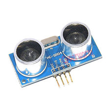This module is for HC-SR04 “sonar” 4-pin device. This is a 5 volt item,
and will not work satisfactorily at a 3.3V supply. The easiest interface
to ESP8266 is:

*   to feed its VCC pin from 5V on the NodeMCU,
*   to simply presume that a 3.3V trigger from ESP8266 will suffice for
    the 5V sonar (outside spec, but it usually works fine),
*   and to connect the echo pin VIA A 6K RESISTOR specifically to
    D8 (gpio15). That pin on ESP8266 usually has an onboard 10K or 12K
    resistor to ground, and we therefore have a suitable voltage divider
    to protect from the 5V of echo pin.

Multiple sonar devices can be configured. Just call Sonar.new() again
for other pins.

run() may be joined into combination initialisation:

	mysonar = Sonar.new(7,8):run()

Optionally, the library can use any LED to visibly show echo time, which
is a useful diagnostic. Or parameter echoLed may be omitted.

run() will start the reading as a background task forever.. By default,
the background reading repeats every 2000 mSec. run() can take one
optional parameter, a custom repeat time in mSec.

You “read” like this:

	dist = mysonar.read()

or

	dist, timestamp = mysonar.read()

where dist is in cm and timestamp is system time of the instant of the
hardware reading, from internal clock. The data received is the last
reading made by the background task. You may use Time(timestamp) to
convert timestamp to readable format.

If you are really squeezed for memory, you can nil the Sonar.new after
use.

## lib-SMARTBTN.lua:

A smartbutton is a gpio with a pulldown button, where it measures the
duration of press. Up to 3 different responses are called, the “short
press” (< 1 Sec), the “1-Sec press” and the “3-Sec press”. Therefore
that one button may be given 3 jobs to do!

	dofile(“lib-SMARTBTN.lua”)

Supply the three callback functions to be executed when the smartbutton
is pressed. Then create the smartbutton with its pin number and its 3
callbacks. (Any of the callbacks may be nil.)

Here is a simple example, using pin D3, the “flash button”, and omitting
the 1-sec response (even though a callback was coded)..

	b0 = function () print ("b0sec pressed") end -- short
	b1 = function () print ("b1sec pressed") end -- 1-sec
	b3 = function () print ("b3sec pressed") end -- 3-sec
	smartButton( 3, b0, nil, b3) -- 1-sec callback omitted

## lib-SERVO.lua:

“Radio Control” hobby servomotors usually need power supply of about 4.5
to 6 volts. There are 3 wires:

-   RED = nominally +4.5 (but +5V is OK) Sometimes a red/orange Usually
    the centre wire. But not always - depends on manufacturer, so
    be careful.
-   BLACK = GND (sometimes brown)
-   3rd wire (ORANGE or YELLOW or WHITE) = pulse signal (from GPIO pin)

Reference: https://www.princeton.edu/~mae412/TEXT/NTRAK2002/292-302.pdf

The ESP8266 NodeMCU board can probably supply enough 5V current for
**one** servo without you resorting to a separate 5V supply. Several
servos is too much for this method. Get a battery pack or other
independent supply.

	dofile("lib-SERVO.lua")
	sv1 = Servo.new(pin, scaling) 

then

	sv1:set(newposn)

position is scaled 0 – 100,. Values above 100 are not actioned. Values
below 0 cause the servo to stop.

Most servos sweep about 170-180 degrees. Scaling is an arbitrary
calibration to map the 0-100 onto the sweep angle of the servo, and
scaling defaults to 130 if omitted. You can experiment with other
values, but about 140 is likely optimum. As low as 80 may be needed on
some servos to avoid over-scan. Servos buzz and get unhappy if driven
past their physical limits.

Current servo setting can be read:

	currentposn = sv1:get()

Multiple servos may be created.

## lib-ACCEL.lua:

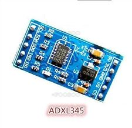The ACCEL library is additional support for triple-axis adxl345 I2C
accelerometer. The NodeMCU Lua firmware build already has a basic driver
for the adxl345, delivering X and Y and Z acceleration values. We have
no evidence of the scaling of the values returned, but we should be
entitled to consider that they are to the same calibration. Refer
http://nodemcu.readthedocs.io/en/dev/en/modules/adxl345/

Your project might want raw accelerometer output for jolt-detection, for
example. However, for our purposes, let us assume:

-   that I2C is probably already initialised for OLED use.
-   that roll and pitch are more useful to us than uncalibrated raw
    aceleration values.

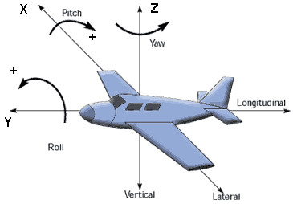Initialise:

	i2c.setup(0, sda, scl, i2c.SLOW) -- if i2c not alr set up
	adxl345.setup() -- but see init() below

So far, the lib-ACCEL library is not needed! The library simply supplies
the math formulae for pitch and roll:

Here is a complete project to read the adxl345 every 3 seconds, use our
2 library formulae to calculate pitch and roll, and display those to the
oled display:

	dofile(“lib-OLED.lua”) -- implicitly sets up the I2C for us. Yea!!
	-- some "builds" of nodemcu lua image use init(), some use setup() syntax:
	if adxl345.setup then
		adxl345.setup() 
	else
		adxl345.init(sda or 2,scl or 1) 
	end
	dofile(“lib-ACCEL.lua”)
	tmr.alarm(2, 3000, 1, function()
			local x, y ,z = adxl345.read()
			print(string.format( "X = %d, Y = %d, Z = %d", x, y, z ) )
			pitch = axl.pitch(y, z) -- inverted pcb
			roll = axl.roll(x, z)
			oled('y', { "P "..pitch, "R "..roll } )
		end 
	) 

## lib-WIFIMON.lua:

A totally optional extension to wifi functionality. It simply
monitors the wifi and prints a message for each disconnection or
reconnection that happens. It reports, but it does not change how wifi
operates. Auto-reconnection is normal, and is not affected by WIFIMON.

	dofile(“lib-WIFIMON.lua”)

lib-WIFIMON is based on information at:

http://nodemcu.readthedocs.io/en/dev/en/modules/wifi/\#wifieventmon-module

## lib-DEEPSLEEP.lua:

Normal operation of ESP8266 uses about 80mA (and peaks to about 300mA!),
which results in short life per battery charge under battery operation.
“Deep Sleep” is a very low power mode where most of the ESP8266 shuts
down, leaving only the RTC module still keeping time in order to rewake
the system later.

If the ESP8266 needs to do occasional tasks such as read a temperature
at regular intervals, and to act on that sometimes (turn on fan? send
message by wifi?), then putting it into deepsleep while otherwise idle
can be an extremely large saving in battery use. Deepsleep can be
worthwhile even if each sleep is only a few seconds, but long sleeps
like an hour or more can be very effective. Deepsleep has little meaning
if you are using a power pack for supply.

You **MUST** connect D0 (GPIO16) to RST, otherwise the waking function
fails. D0 is not a regular GPIO pin, it is a timeout pin coming from
the RTC module. ESP-01 module does not expose D0, so deepsleep cannot be
implemented on that.

Some “nodeMCU” style boards with USB chips continue to draw considerable
board power even when the ESP itself sleeps, and deepsleep then is not
the huge power saving benefit being sought. But some boards work well on
deepsleep. You can test your own case.

During deep sleep the RTC still keeps time, and the RTC section also
preserves some small block of memory. The RTC time and that RTC memory
data can be preserved through the reset/wake process. In other respects,
waking from deepsleep proceeds the same as any normal reset, ie, full
initialising messages, and looking to start with init.lua.

The lib-DEEPSLEEP.lua module attempts to simplify deepsleep programming.
It can be otherwise frustrating to program smoothly.

Load the library:

	dofile("lib-DEEPSLEEP.lua")

This simple instruction in your project can then sleep:

	DEEPSLEEP(60) -- in seconds, so that sleeps 1 minute

Your project file of course needs to handle putting to sleep, and then
handling life as normal after the waking. And then deciding when to
sleep again next time.

The ESP8266 has a maximum sleep time of just over one hour. If we wanted
very long sleeps, we could sleep several times, waking between each pass
just long enough to recognise we have more sleeps to go. The library can
accommodate that easily, and so scheduling an (aggregated) sleep of say
12 hours can be done in one library call.

	DEEPSLEEP(3600, 3, 12) 

This would sleep for 12 hours as 12 passes x 60 minutes, even (the 3
parameter) skipping time-wasting wifi & time sync in the quick
intermediate wakeups.

The full function is:

	DEEPSLEEP(sleeptime, startType, passes)

-   sleeptime is the time (secs) for each sleep “pass”
-   startType is how fully to wake up on each “pass” - default 0 if
    omitted
    -   0 = full start (with that 5 sec delay) at each wake from sleep
    -   1 = full wifi start (but without delay) at each wake from sleep
    -   3 = straight to project (no delay, no wifi) at wake between
        sleeps
-   passes = how many sleep passes are scheduled in the sequence – def 1

You may need to be mindful of just where in your project file you put the line
dofile(“lib-DEEPSLEEP.lua”), because while it loads, the library
immediately examines whether it is partway through a sequence of passes.
In which case it IMMEDIATELY returns to sleep for the next pass, and
does not return control to your project.

You may note that our init.lua has some code relating to the deepsleep
function. That section examines the stored “startType”, and tests
whether an abbreviated startup is being requested.

If you are testing, and using multi-pass sleeps sequence, then on some
boards pressing the reset button will terminate that pass, but the
remaining passes will still proceed. It depends on the exact board
schematic and that varies! (NodeMCU 1.0 – NO. Lolin “V3” - YES) 

Power off / power on always erases all RTC time and data, and results in clean
normal start.

Because deepsleep timekeeping has poor accuracy, wakeup times may drift,
and this can accumulate over multiple passes. There **is scope** for a
carefully constructed project file to be controlling and re-syncing real
time intelligently. However, it is easier to simply accept a simple
lower accuracy system. Just don’t then expect to wake for your readings
on every precise hour with a few seconds accuracy.

## lib-TELNET.lua:

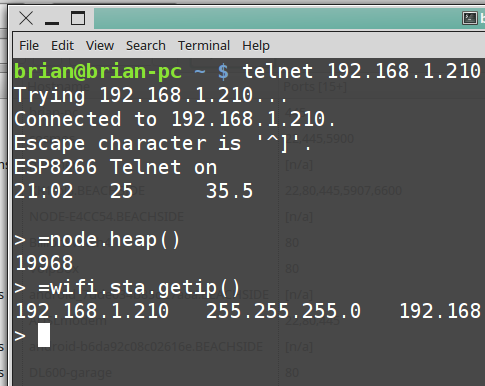Runs a telnet server on ESP8266. From another PC on your network, you
get the same interpreter / commandline functionality as you see in
ESPlorer. Any programmed Lua serial output, eg print( “hello world” ),
duplicates to the telnet terminal.

You do NOT get ability to load lua files to the ESP via telnet.

Default port 2323, but preceding the library call with an override like
this

	tport=23  -- conventional telnet port
	dofile("lib-TELNET.lua")

would then use your choice of port.

**Example on a linux PC:** Open terminal and run telnet with correct IP
and port. Execute some lua commands:

	**brian@mypc** ~ $ telnet 192.168.1.212 23
	Trying 192.168.1.212...
	Connected to 192.168.1.212.
	Escape character is '^]'.
	ESP8266 Telnet on
	> 
	> =wifi.sta.getip()
	192.168.1.212 255.255.255.0 192.168.1.254
	> =node.heap()
	37760
	> node.restart() -> Bye !!!

**On Windows**:
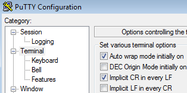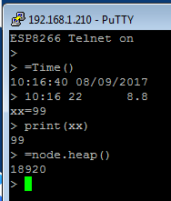The native windows telnet client doesn't seem to work properly in our case. But simply install puTTY from the internet. In puTTY's settings, set Terminal/Implicit CR in every LF. Otherwise it's plain sailing.

For security, ESPlorer will indicate **ESP8266 Telnet on** or **Telnet
Fin** as PC logs on and off.

Telnet makes a very workable occasional substitute for ESPlorer after
you have deployed your project. You can even install a telnet client on your 
apple or android device.  Activate telnet on your battery-powered ESP8266, and you can still "talk" to it!

Telnet library based on

https://github.com/nodemcu/nodemcu-firmware/blob/master/lua_examples/telnet.lua

## lib-LOGGER.lua:

The log is a plaintext file “**@log.var**” kept on flash filesystem on
ESP2866. It records successive data entries of the format

	Timestamp (readable) Descriptor Value

This file is not designed to be large, typically 20 to 40 lines long.
Oldest data is dumped to allow new data. The log may be cleared simply
by deleting the file, as it is recreated empty if found to be missing.
Unless explicitly cleared, the log is preserved over board resets, or
over any lua file updates.

	dofile(“lib-LOGGER.lua”)

Starts the logging system. As supplied, the library file writes one
entry (description = “Reset”) each initialisation. Remove that line
(bottom of file) if not needed.

The following functions are supported:

**writeLog(description, value)**

**viewLog()** -- displays to ESPlorer screen, or to telnet terminal if
used.

**newLog()** -- deletes the logfile.

Any project may write to the logger. The library “lib-WEBSERV.lua” also
has functions to read the log at a remote web browser, or to clear the
log.

## lib-THINGSPEAK.lua:

This library allows data postings to your “channel” on ThingSpeak:

**https://thingspeak.com**

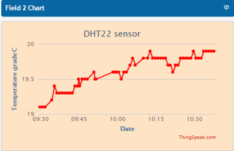ThingSpeak is devoted to collecting repeat data, and allows analysis and
plotting of the collected data. For paid subscription, very
sophisticated analysis tools are available, including MatLab analytics.
For a free subscription, basic but very usable plotting tools are still
available.

Sign up for an account. Don’t be persuaded that you need a paid
subscription. You then need to create a “channel” for data collection.
Give it a channel name. Each channel is allowed up to 8 “fields”.

For example I have a channel called “Brian1” and it has an “ID number”.
I have four fields activated: Field1 = Temp”, Field2 = “Lolin read32”,
Field4 = “ESP01 vdd33”, Field5 = “Humidity”. I have been given (all on
the website) two “API Keys”. Consider them as passwords. One is for
Write, one for Read. Somewhere I have set my channel as viewable
publicly by ID number (I can’t find where I did it). Therefore, the Read
API key is probably not needed. I do need the Write API Key to let my
library write data to the fields in my channel.

So firstly, have your correct WRITE API KEY available. Edit it into lib-THINGSPEAK.lua.
Then in your project, load ThingSpeak like this:

	dofile(“lib-THINGSPEAK.lua”)

There is no constant connection from the ESP to ThingSpeak server. Each
posting call makes a short-term network connection, and then closes it.

The library file has a single function call. It accepts one field per
call. Thinkspeak free version limits postings to no sooner than 15 seconds apart, so your project must adhere to this limit.

	postThingSpeak(fieldnumber, data, fieldname)

-   fieldnumber must be 1 up to 8.
-   data = the value you are sending
-   fieldname does not get transmitted. It simply prints to screen to
    look good.

Here is a posting in your project of analog pin reading to ThingSpeak:

	volt = adc.read(0); 
	postThingSpeak(4, volt, “Volt Reading” ) 

The library should display a success message to screen. On your web
browser, use the following to see public view of your channel data
(using YOUR channel number):

**https://thingspeak.com/channels/999999**

ThingSpeak viewers are also available on smartphones and tablets.
Convenient apps on android include ThingView and Pocket IoT, and these
can easily be configured to monitor data sent from the ESP8266 to
ThingSpeak.

Basis for this library:

https://captain-slow.dk/2015/04/16/posting-to-thingspeak-with-esp8266-and-nodemcu/

## lib-MQTT.lua:

The MQTT model is for two or more machines to transfer simple data
packets (which might mean a command or might mean some data) between
them. The data always passes through an intermediary server. To push
data towards the server is called “publishing”, and each piece of data
belongs to a “topic”. To collect any data from the server, another
machine (or several) “subscribes” to the required topic(s), and the server
sends that topic’s data as it is available.

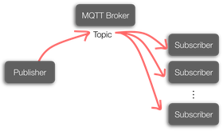The main MQTT server (“broker”) is CloudMQTT, but the server technology
is open source, and other servers exist. You can install your own, for
example mosquitto on Raspberry Pi. Our library will presume you use a
CloudMQTT account. Adapt as you need if you want another server.

And there is no problem for any client being both a publisher and a subscriber.

Each client machine connecting to the server will try to hold a constant connection.

Each machine may be small like an arduino, Raspberry Pi or ESP8266. It
may be a PC. Or it may be a smartphone or tablet. A convenient MQTT app
on android is MQTT Dashboard..

Edit your lib-MQTT file to list correctly your 4 credentials for MQTT
login: BROKER, BRPORT, BRUSER, BRPWD.

There are three items to be coded in your project file **before**
loading the library file:

1.  **mqtt_topics** = table of topic/qos pairs to be subscribed.
2.  **mqtt_ready()** - callback from library to project when MQTT has initialised
3.  **mqtt_recv(topic, data)** - callback from library to project when
    a (subscribed) message arrives

Now load the library:

	dofile(“lib-MQTT.lua”)

Then there is one call your project can make into the library:

4.  **mqtt_publish(topic, data)** - call from project into library to
    publish a payload to a topic

Typical use of mqtt_ready(). Start a 20-second repeat for reading LDR
value and publishing that:

	function mqtt_ready()
		tmr.alarm(2, 20000, 1, function() 
				mqtt_publish("LDR", readLDR()) 
			end 
		)
	end

Typical subscribed topics list in your project:

	mqtt_topics = {Led1=0, Led2=0, OledMsg=0, testButn=0} -- qos all 0

Typical callback to handle incoming messages on those subscribed topics:

	function mqtt_recv(topic, data)
		if topic == "Led1" then gpio.write(4,data=="0" and 0 or 1) end
		if topic == "Led2" then gpio.write(0,data=="0" and 0 or 1) end
		if topic == "OledMsg" then oled("j",data) end
		if topic == "testButn" then mqtt_publish("Button", gpio.read(3)) end 
	end 

Note that last (testButn) incoming topic. Our response here is to send
back (publish) our “Button” data to the other end. So this looks like a
poll transaction. The other end make a read request. We make the
reading, and send that back to the other end.

## lib-WEBSERV.lua:

This library starts a webserver on the ESP8266. You can view the web page from any
browser having network access. Page title and some page controls are
automatic. As below, you need to supply the central html excerpt for your project.

By default, the logger system (if it is loaded) has view-log and
delete-log buttons on the web page. This can be suppressed if variable
**WS_suppressLogger** is true.

if variable **WS_pageRefresh**=(number xx), then the web page will
auto-refresh in the browser every xx seconds.

If variable **WS_tnet** is true, primitive telnet controls will be
activated on the browser page. Enter your input to the box and press
enter. Then press See Result if you want to view any response that the
ESPlorer screen would have shown you. Eg “=node.heap()” into box.

Followed by **See Result** button, to view the “32763” reply.

The library includes one utility function **button(vbl, value, label,
colour)** that can build a boilerplate HTML button.

In general, an empty web page is useless. Your project needs to
implement a function **WS_buildpage(_GET)** to add custom HTML
controls to the page.

Your code should build (into the global variable webPage) the HTML
fragments to display some control buttons the user can click. The
parameter _GET brings back a table with key:value pair corresponding to the
user’s last button click on their browser. The following project codes a
HTML clickable pair of buttons. It also reacts to user’s last click to
turn a GPIO (led on gpio16/D0) on or off. We are looking for the key
value pairs **pin:ON1** or **pin:OFF1** because that’s the way we coded
our buttons.

	function WS_buildpage(_GET)
		-- first process any buttons that user pressed:
		if (_GET.pin == "ON1") then -- examine last button click
			gpio.write(led1, gpio.HIGH) -- and set gpio accordingly
		elseif (_GET.pin == "OFF1") then
			gpio.write(led1, gpio.LOW)
		end
	
		-- now code the buttons again for next display
		webPage = webPage.. "
GPI016 " .. button("pin", "ON1", "HIGH") ..
			" " .. button("pin", "OFF1", "LOW") .. " redled
\n"
		if gpio.read(led1) == 0 then 
			webPage = webPage .. "
RED LED ON 
\n" -- feedback for user
		end
	end
	WS_suppressLogger = true
	dofile(“lib-WEBSERV.lua”)

## lib-GPIO28.lua:

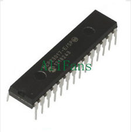Uses a MCP23017 chip on I2C address 0x20 to add **new GPIO numbers 13 to
28**. GPIO syntax remains the same:

	i2c.setup(0, sda, scl, i2c.SLOW) -- if needed
	dofile(“lib-GPIO28.lua”)
	gpio.mode(17,gpio.OUTPUT) 
	gpio.write(17, gpio.HIGH)

That code assumes I2C needs initialising. If OLED for example has
already initialised I2C, omit the first line.

Also note that the I2C bus needs at least one pair of pullup resistors (to 3.3V). 
Most PCB modules include such resistors, but if you are here using
a simple mcp23017 chip, and you are not using anything else
on I2C, you should add your own pullups.

## lib-ADC8.lua

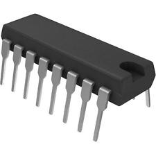Uses CD4051 analog multiplexer chip to expand the one **ADC to 8
channels** (0 – 7). Requires connecting 3 digital GPIO pins to select the analog channel on the
CD4051. (If GPIO28 is installed first, the expanded gpio pins could be
used.)

Use **adc.init8(s0, s1, s2)** to enable the extra channel functionality.
Default addressing GPIOs (if omitted) are D6 D7 D8. Or specifying just one
will assume a consecutive three. 
adc.read() syntax is same style as the original one channel.

	dofile(“lib-ADC8.lua”)
	adc.init8(6,7,8)
	v5 = adc.read(5)

## lib-ADC4.lua

Uses one PCF8591 module to expand ADC by **four new read()
channels and one write() channel**. 

I2C address 0x48 is assumed but the library itself can be altered. If you have no other I2C devices already running, then init the I2C before loading the library, as per several earlier examples. 

Loading the library will initialise the extra channels only if the PCF8591 device is detected.

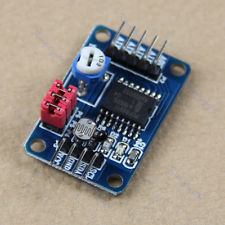The new ADC read() channels are numbered 8 to 11. 
The adc.read() syntax is the same as usual, and a new adc.write()
function is added:

	dofile("lib-ADC4.lua")
	
	for c=8, 11
	do
	    print(c, adc.read(c) )
	end
	adc.write(57)

This device uses 8-bit analog (0-255), whereas the inbuilt analog on esp8266
(and expanded adc using CD4051) uses 10-bits (0-1023).

This library is compatible with ADC8. 
Either one or both together may be used.

## lib-STEPPER.lua

This library drives one or more unipolar stepper motors.
They are driven by the tmr.alarm() process, not genuine interrupt
code, so they have inherent limitations of speed and jitter and interaction. 
In particular, using extended GPIO, which use I2C for each GPIO switch, allows only 
slow operation. 

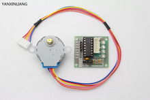This will load the library and create two stepper objects, one at GPIO pins 4,5,6,7
and the other at pins 15,16,17,18 (on the mcp23017 extended GPIOs).

	dofile("lib-STEPPER.lua")
	stp1=Stepper.new(4)
	stp2=Stepper.new(15)

Here are two typical "run" commands for these 2 steppers:

	stp1:run(1, 1, 100, fin_cb, 3, 0)
	stp4:run(-2, 1, 40)
	-- run(direction, mSecPerStep, TotalSteps, finish_callback, limitSwitchPin, LimitPinPolarity)

Arguments (none of them compulsory) are: 

-   Direction is 0=stop (default) 1=singlestepFwd 2=doublestepFwd -1=singleRev -2=doubleRev
    So "stpr()" would cause a stop.
-   mSecPerStep. Practical lower limit is 2 (default). For extended GPIOs, this parameter
    is wildly inaccurate and the stepper simply goes at its best speed for the setting!
-   TotalSteps. 1+, or -2=no limit (Default   -2) 
-   Callback when run stops. Two parameters passed to callback:  
    (stepper object ID, steps left not done at end of run). Default = no callback.
-   Limit Switch = GPIO with switch. If switch turns on, terminate stepper run. DefaultPin=nil = not used. 
    Default polarity = 1.

Accumulated steps moved can be read from **stp1.posn**. Stp1.posn may also be reset
to zero at any time (eg after a calibration run terminated against a limit switch).

The "pin1" setting can be retrieved any time by **stp1.pin1**.  

If several steppers run simultaneously, then their code sequences will interleave, with probable 
slowing of the speeds.   

The library code assumes HI outputs activate stepper coils. Rewrite state8{} in negative
if you want the opposite.  The current code also puts all drive outputs LO at end of a run, 
ie de-energises the stepper.

The popular little 28BYJ-48 stepper motor as in the image above has 64 steps/rev, but then has a further 64:1 internal gearing. This limits the maximum speed with our stepper library (at double stepping, 500 pulses/sec) to about 4.7 seconds/revolution, but for this model this is probably approaching its maximum anyway. An ungeared stepper will give much greater shaft speeds.

And that slower performance using the extended GPIOs? Best speed then is about 9% of best speed
using normal GPIOs (D1 - D12). On the BYJ-48, maybe OK for a dial pointer, but too slow for any robot wheel. Use an ungeared stepper.

## lib-MATH.lua

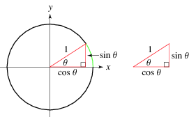This library adds selected missing functions to the inbuilt math suite: 

-   math.sin() 
-   math.cos() 
-   math.atan()
-   math.atan2() 
-   math.rad

The ACCEL and GPS libraries implicitly load these math extensions as needed, so probably you do not
need to explicitly load anything.

## lib-GPS.lua

This library is support for GPS coordinates (in lat/long degrees) sent from your smartphone
by Blynk. It has functions for calculating distance (km) and direction/bearing 
(compass degrees) between two GPS readings.

	dofile("lib-GPS.lua")
	gps.Ref(home_latitude, home_longitude)

and when blynk lat/long arrive from phone:

	d, b = gps.Distance(phone_lat, phone_long)
	print("Dist / Bearing of phone", d, b)

## lib-TONE.lua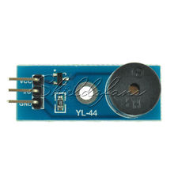

Tone generator for a single passive beeper. Freq 100 - 1000 Hz.

	tone(pin, hz, msec [,fin_callback])

## lib-MAX7219.lua

This library supports 7-segment and 8x8 SPI LED displays, either single or multiple in daisychained connection.

Connect as follows:

-   D5=clk(8266)=clk(Max7219)
-   D7=mosi(8266)=DataIn(Max7219)
-   D8=cs(8266)=cs(Max7219)   
-   VCC(Max7219) to +5(8266)
-   Gnd

Options in your project file **before** loading the library file can be:

-   MAX_type=8 :  This configures for 8x8 nodules. Default is 7-segment modules
-   MAX_modules=3 :  Number of modules daisychained. Default is 1
-   MAX_intensity=6 : Intensity of LEDs is 0 to 15. Default 1
-   MAX_cs=x  : The default CS pin is D8. This option can choose an alternative pin.

Typical use:

	dofile("lib-MAX7219.lua")
	max7219.clear()
	max7219.shutdown(true)      -- or false! Display data is preserved
	max7219.write("5")          -- 7-seg has 8 characters/module, 8x8 has 1 character/module
	max7219.write("Hello",true) -- the second parameter (7-seg module) is true=right-aligned

The MAX7219 devices have no inbuilt fonts. They simply turn LEDs on or off according to the bit patterns sent to them. We need to supply our own bitmap font files. The library expects these to be recorded/saved on Lua's flash filesystem. (This saves precious RAM memory space). The following utility files will generate the font files directly to the ESP8266. Just run them on the ESP8266.

-   x-font8x8.lua  -  generate bitmaps for 8x8 modules
-   x-font7seg.lua -  generate bitmaps for 7-segment modules

If you try to run lib-MAX7219.lua without the font files existing, it will try immediately to run the appropriate bitmap generator. This just happens the once.

lib-MAX7219 library takes moderate RAM. You may find that running MAX7219 and BLYNK (which takes a LOT of RAM) and even more libs all together can exhaust ESP8266 memory. Crash. Sorry.

It is also possible to NOT use the inbuilt fonts, but instead to use hand-coded bitmap
fonts for each character. Use a raw max7219.**_write**() function instead of the usual max7219.**write**(). Following is a code example with manual bitmaps for letters a,b,c.  With 3 modules daisychained, we could print "abc". This technique could allow special characters like heart or arrow, but is overkill for normal text or numeric display.

	MAX_modules=3
	MAX_type=8
	dofile("lib-MAX7219.lua")
	local a = { 0x20, 0x74, 0x54, 0x54, 0x3C, 0x78, 0x40, 0x00 }
	local b = { 0x41, 0x7F, 0x3F, 0x48, 0x48, 0x78, 0x30, 0x00 }
	local c = { 0x38, 0x7C, 0x44, 0x44, 0x6C, 0x28, 0x00, 0x00 }
	max7219._write({a,b,c})

## ENJOY

This suite is consolidated from many projects taught at (adult) IoT classes over 2016 and 2017. Initially at least, there are likely to be a few gpio inconsistencies, or function namings that got changed sometime and haven't been brought into line. If you spot anything, just send a message and I'll fix it.

Opinion: Despite the ESP8266 Lua being "panicky" while you are still crafting your project, the Lua interpreter platform is still a better learning environment than the alternatives.

Brian Lavery

esuite@blavery.com

V0.4.1

10 Sept 2017
